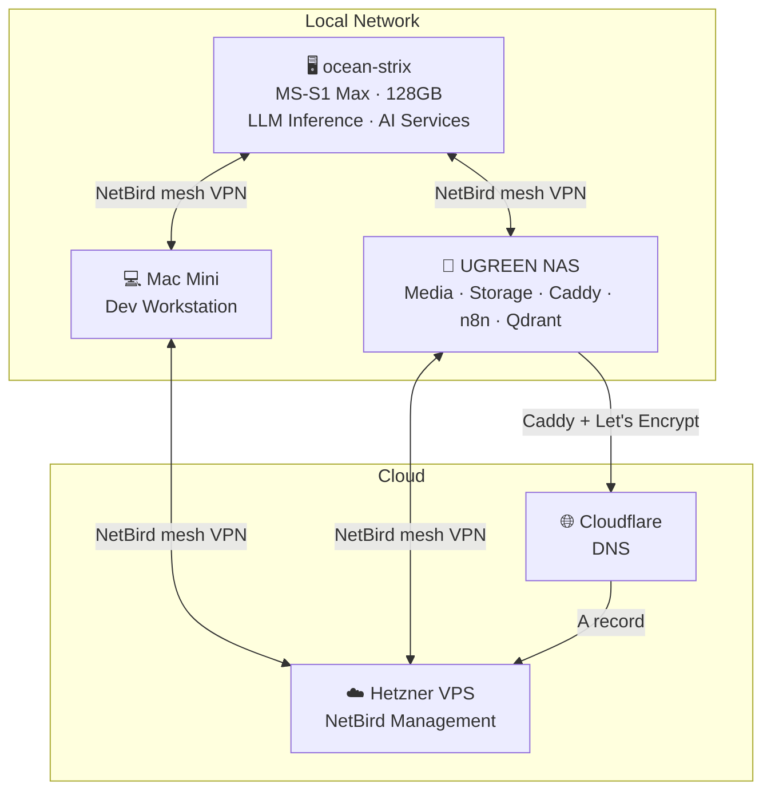

# 🏠 Ocean Homelab

A self-hosted AI and automation stack running on commodity hardware — 128GB unified memory, local LLMs, voice/vision assistants, and a personal knowledge base that can answer questions about any document I own.

Built by Sagar — feel free to ask questions or share ideas.

---

## Hardware

| Device | Role | Key Specs |
|--------|------|-----------|
| **ocean-strix** (Minisforum MS-S1 Max) | LLM inference, AI services | AMD Strix Halo · 128GB unified RAM · Radeon 8060S iGPU |
| **Mac Mini** (M-series) | Dev workstation, Claude Code | 24GB RAM |
| **UGREEN NAS** | Storage, media, reverse proxy, automation | Docker host for most services |
| **Hetzner VPS** (ARM64) | NetBird management, Traefik | Ubuntu 24.04, Nuremberg |

The 128GB unified memory on ocean-strix is the key asset — the iGPU shares all system RAM, enabling 70B+ parameter models to fit entirely in memory.

---

## Architecture

---

## What's Running

| Section | What it covers |
|---------|---------------|
| [AI Services](ai-services/README.md) | LLM inference, vision agent, voice chat, TTS |
| [Knowledge Base](knowledge-base/README.md) | RAG chatbot over all NAS documents |
| [n8n Workflows](workflows/n8n.md) | Automation pipelines — ingestion, OCR, chat |
| [Networking](networking/netbird.md) | NetBird VPN, Cloudflare DNS, Caddy HTTPS |
| [Obsidian](obsidian/README.md) | Self-hosted note sync |
| [Hardware](hardware/overview.md) | Full device specs |

---

## Principles

- **Everything local** — no data leaves the network except through Cloudflare DNS
- **No cloud LLMs** — all inference runs on ocean-strix hardware
- **OpenAI-compatible APIs** — all services expose standard endpoints; easy to swap models
- **Docker + systemd** — Docker for stateless services, systemd for GPU-bound native processes
