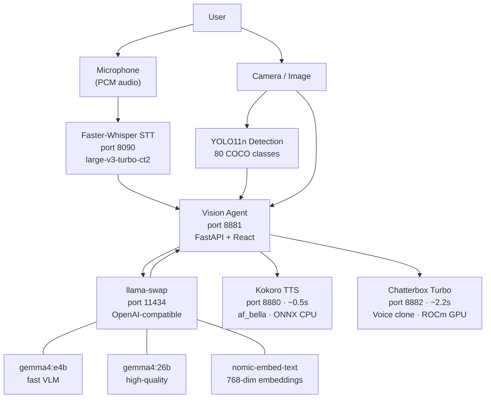

# AI Services

All AI services run locally on **ocean-strix** (128GB unified memory). No cloud API calls — everything from speech recognition to LLM inference to TTS runs on-device.

## Stack Overview

## Services

| Service | Port | Description |
|---------|------|-------------|
| [Vision Agent](vision-agent.md) | 8881 | Full-stack voice + vision app |
| [LLM Inference](llm-inference.md) | 11434 | llama-swap multi-model proxy |
| [TTS](tts.md) | 8880 / 8882 | Kokoro (fast) + Chatterbox (expressive) |
| Whisper STT | 8090 | Speech-to-text, OpenAI-compatible |
| Open WebUI | 3000 | Chat UI connected to llama-swap |
