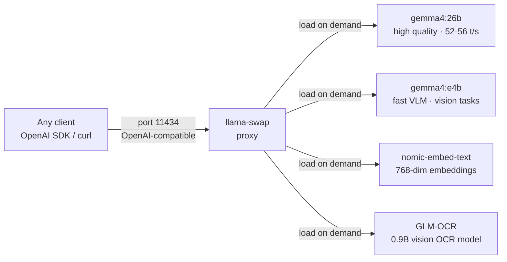
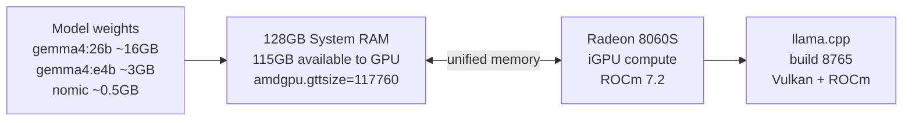

# LLM Inference — llama-swap + llama.cpp

## Why Not Ollama?

Ollama was the first choice — easy setup, great model library. But on AMD Strix Halo, Ollama's bundled llama.cpp (Dec 2025 build) was missing two critical AMD Vulkan PRs:

- **Wave32 Flash Attention** (`PR #19625`) — significant throughput improvement for AMD RDNA3+
- **Graphics queue routing** (`PR #20551`) — uses the correct GPU queue for compute

Result: Ollama gave ~34 tokens/sec on gemma4:26b. Building llama.cpp from source (build 8765) and running it via **llama-swap** gives **52-56 tokens/sec** — matching Windows LM Studio performance.

---

## llama-swap

[llama-swap](https://github.com/mostlygeek/llama-swap) is a lightweight proxy that sits on port 11434 (same as Ollama) and manages multiple llama.cpp model servers. It loads/unloads models on demand and exposes a single OpenAI-compatible endpoint.



---

## Models

| Model | Parameters | Use Case | Tokens/sec |
|-------|-----------|----------|-----------|
| gemma4:26b | 26B | General chat, knowledge base Q&A | 52-56 t/s |
| gemma4:e4b | ~4B effective (MoE) | Vision tasks, fast responses | faster |
| nomic-embed-text | 137M | Document embeddings (768-dim) | — |
| GLM-OCR (Q8_0) | 0.9B | Scanned PDF text extraction | — |

All models run as GGUF via llama.cpp. The 128GB unified RAM means even 26B models at Q4 fit entirely in GPU-accessible memory.

---

## Hardware Context

The AMD Strix Halo's iGPU (Radeon 8060S) shares all 128GB of system RAM — there's no VRAM ceiling. The bottleneck is iGPU compute throughput, not memory capacity. This is why:

- **Large models load fine** — 26B at Q4 ≈ 16GB, nowhere near the 115GB GPU budget
- **Speed is fixed** — throwing more RAM doesn't help; compute is the limit
- **ROCm is essential** — CPU fallback would give ~3-4 t/s; GPU gives 52-56 t/s



---

## Key llama.cpp Flags

```bash
# nomic-embed-text — physical batch size matters for long chunks
--ubatch-size 2048   # physical batch; default 512 causes 500 errors on long embeddings
--batch-size 2048    # logical batch

# All models
--n-gpu-layers 999   # offload all layers to GPU
```
