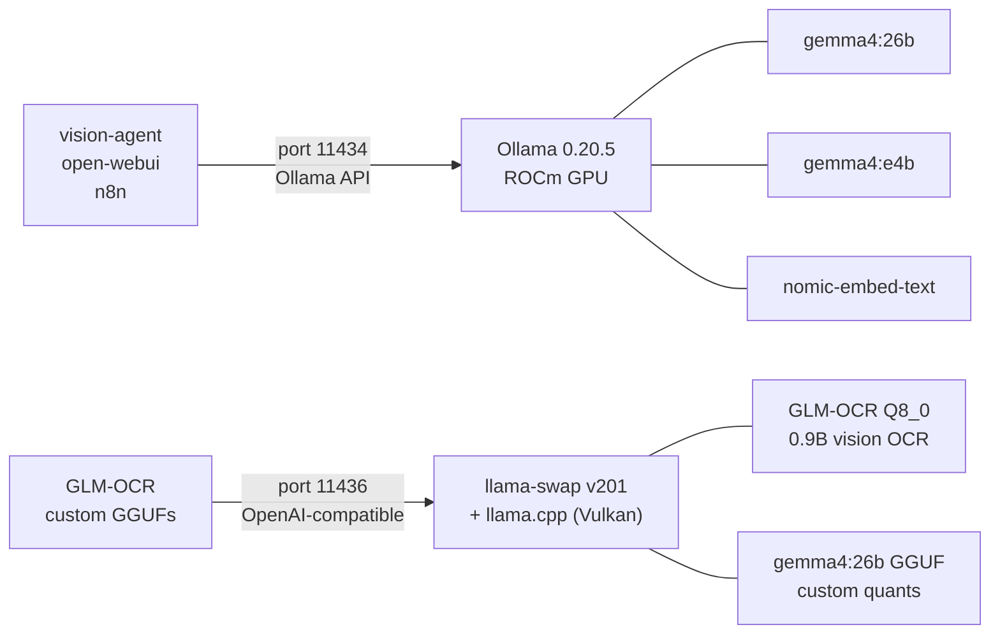
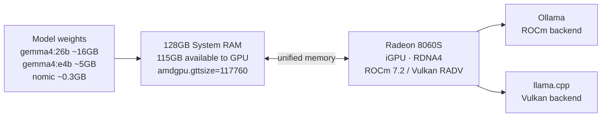

# LLM Inference — Ollama + llama-swap + llama.cpp

Two inference services run simultaneously on ocean-strix, serving different use cases:



---

## Services at a Glance

| Component | Tool | Port | Primary use |
|-----------|------|------|-------------|
| Inference (Ollama-managed models) | Ollama 0.20.5 (ROCm) | **11434** | vision-agent, open-webui, n8n |
| Inference (custom GGUFs) | llama-swap v201 + llama.cpp (Vulkan) | **11436** | GLM-OCR, models not in Ollama registry |
| Vulkan driver | RADV (Mesa) | — | gfx1151 / Strix Halo |

**Ollama** is the primary inference API for all main services. **llama-swap** handles models that aren't in Ollama's registry or need custom quantisations.

---

## Models

| Model | Parameters | Use Case | Service |
|-------|-----------|----------|---------|
| gemma4:26b | 26B | General chat, knowledge base Q&A | Ollama |
| gemma4:e4b | ~4B effective (MoE) | Vision tasks, fast responses | Ollama |
| nomic-embed-text | 137M | Document embeddings (768-dim) | Ollama |
| GLM-OCR (Q8_0) | 0.9B | Scanned PDF text extraction | llama-swap |

---

## Performance Benchmarks

### All models — Ollama ROCm (2026-04-17, isolated runs, amdgpu 31.10, gfx1151)

Each model tested individually with GPU at 95%+ busy — confirms real GPU compute, no CPU fallback.

| Model | Size | Generation speed | Notes |
|-------|------|-----------------|-------|
| gemma4:26b | 17 GB | **54.4 t/s** | Full GPU |
| gemma4:e4b | 9.6 GB | **55.2 t/s** | Full GPU |
| qwen3.5:9b | 6.6 GB | **32.7 t/s** | Full GPU |
| gemma3:27b | 17 GB | **11.8 t/s** | Full GPU — older arch, slower |
| qwen2.5:32b | 19 GB | **11.0 t/s** | Full GPU |
| gpt-oss:120b | 65 GB | **26.6 t/s** | Partial GPU (32/37 layers) |
| qwen3.5:122b | 81 GB | **9.3 t/s** | Partial GPU — 81GB model in 115GB budget |
| nomic-embed-text | 274 MB | — | Embedding only |
| GLM-OCR (Q8_0) | 2.2 GB | — | Vision OCR — needs image input |

### Backend comparison — gemma4:26b Q4_K

| Backend | t/s |
|---------|-----|
| **Native Ollama 0.20.7 ROCm** | **54.4 t/s** |
| llama-swap + Vulkan (llama.cpp b8765) | 52.3 t/s |
| llama.cpp HIP build (b8765) | 48.6 t/s |
| Ollama 0.21.0 ROCm Docker | 46.2 t/s |
| Ollama 0.20.5 Vulkan (old production) | ~34 t/s |
| Windows LM Studio (same hardware) | ~56 t/s |

Native Ollama ROCm (0.20.7) edges out Vulkan — the native install gets better-tuned ROCm libs than the Docker image.

### Llama-bench baseline — Vulkan, fresh context (pp512 / tg128)

Measured with llama.cpp b8765, `-ngl 99 -mmp 0 -fa 1`

| Model | Size | Prompt processing | Generation |
|-------|------|------------------|-----------|
| gemma4:26b Q4_K_XL | 15.9 GB | 1,232 t/s | **52.3 t/s** |
| gemma4:e4b Q4_K_XL | 4.7 GB | 1,919 t/s | **56.2 t/s** |
| nomic-embed-text F16 | 261 MB | 36,227 t/s | n/a |

### Generation speed vs context depth (gemma4:26b, tg128)

Speed degrades as context grows — unified memory bandwidth is the bottleneck at very long contexts.

| Context depth | gemma4:26b | gemma4:e4b |
|--------------|-----------|-----------|
| d0 (fresh) | 52.3 t/s | 56.2 t/s |
| d8k | 45.6 t/s | ~50 t/s |
| d32k | 40.1 t/s | 42.5 t/s |
| d64k | 35.1 t/s | 35.0 t/s |
| d128k | 17.0 t/s | 26.1 t/s |

**Default context: 32k** — gives 40+ t/s at depth, handles large documents, well within the 128GB memory budget.

---

## Hardware Context

The AMD Strix Halo's iGPU (Radeon 8060S) shares all 128GB of system RAM — there's no VRAM ceiling. The bottleneck is iGPU memory bandwidth, not capacity.



- **Large models load easily** — 26B at Q4 ≈ 16GB, nowhere near the 115GB GPU budget
- **Speed is bandwidth-bound** — at long contexts (d128k) bandwidth pressure reduces throughput significantly
- **ROCm/Vulkan essential** — CPU fallback gives ~3-4 t/s; GPU gives 40-56 t/s depending on context

---

## When to Use Which Service

| Use case | Service | Port |
|----------|---------|------|
| vision-agent chat / vision | Ollama | 11434 |
| open-webui chat | Ollama | 11434 |
| n8n LLM + embedding workflows | Ollama | 11434 |
| GLM-OCR (NAS document scanning) | llama-swap | 11436 |
| Custom GGUF not in Ollama registry | llama-swap | 11436 |

---

## Key llama.cpp Flags (llama-swap models)

```bash
--n-gpu-layers 999     # offload all layers to GPU
--ubatch-size 2048     # physical batch — default 512 causes errors on long embeddings
--batch-size 2048      # logical batch
--flash-attn           # Flash Attention (critical for AMD Vulkan throughput)
```
