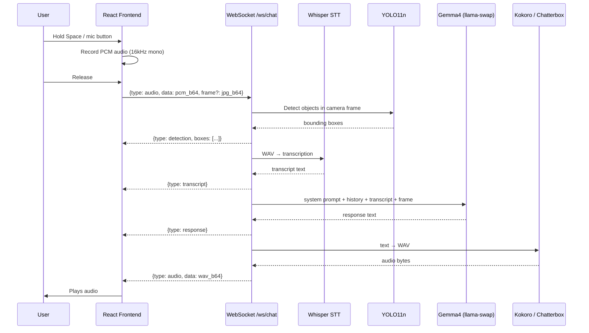

# Vision Agent

A local voice + vision assistant with a React frontend. Talk to it via microphone, show it your camera, and it responds with synthesised speech — all running on ocean-strix, nothing in the cloud.

**Stack:** Python 3.12, FastAPI, React 18 + TypeScript + Vite, YOLO11n, Gemma4, Whisper, Kokoro/Chatterbox TTS

---

## Features

| Tab | What it does |
|-----|-------------|
| **Image Analyze** | Upload or webcam snapshot → YOLO detection + Gemma4 vision answer |
| **Live Chat** | Push-to-talk voice conversation with optional live camera feed |
| **Video Track** | Upload video → ByteTrack per-object tracking → annotated MP4 download |
| **Text to Speech** | Type text, pick voice, play WAV |

---

## Voice Chat Pipeline

---

## Object Detection

YOLO11n runs on every camera frame (polling at 800ms intervals) and on each voice message that includes a frame. Detected objects are shown as bounding boxes overlaid on the camera feed and as pill badges below.

- Model: `yolo11n.pt` — 80 COCO classes (people, cars, trucks, bikes, animals, furniture, etc.)
- Detection threshold: 0.35 confidence, 0.45 NMS IOU
- **Not supported:** buildings, rooms, landscapes (not in COCO 80 — would need a specialist model)

---

## Video Tracking

Upload a video and get per-object tracking with coloured bounding boxes and ID labels.

- Algorithm: ByteTrack (via YOLO `.track()`)
- Max frames processed: 300, evenly sampled across full video duration
- Max video length: 5 minutes
- Browser preview: 60 frames at 854px wide (keeps JSON response under 10MB)
- Download: full-resolution annotated MP4 (H.264)

---

## API

| Route | Description |
|-------|-------------|
| `GET /` | React frontend |
| `POST /analyze` | Image + text query → annotated image + LLM answer |
| `POST /detect` | Image → YOLO bounding boxes |
| `POST /track` | Video → tracking result + preview frames + download token |
| `GET /track/download/{token}` | Download annotated MP4 |
| `WS /ws/chat` | Voice + vision WebSocket |
