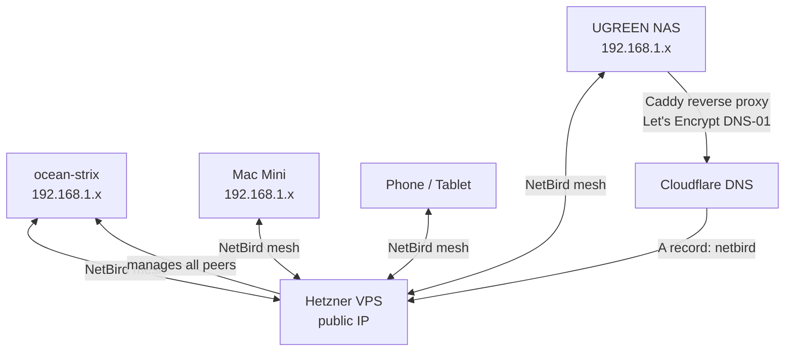

# Hardware Overview

## Devices

### ocean-strix — Primary AI Workstation

| Spec | Value |
|------|-------|
| Chassis | Minisforum MS-S1 Max |
| CPU | AMD Strix Halo (Ryzen AI MAX+ 395) — 16 cores |
| GPU | Radeon 8060S (integrated, unified memory) |
| RAM | 128GB LPDDR5X — shared between CPU and iGPU |
| Storage | ~2TB NVMe (Ubuntu 24.04 primary) |
| NIC | Realtek RTL8127 10GbE |
| OS | Ubuntu 24.04 LTS + kernel 6.17 HWE |
| Role | LLM inference, vision agent, TTS, Whisper STT |

**Why 128GB unified memory matters:** The iGPU has no dedicated VRAM — it draws from system RAM. This means a 70B parameter model at Q4 quantisation (~40GB) fits entirely in GPU-accessible memory, enabling full GPU inference that would otherwise require a high-end discrete GPU with expensive VRAM.

### Mac Mini — Development Workstation

| Spec | Value |
|------|-------|
| Chip | Apple Silicon M-series |
| RAM | 24GB unified |
| Role | Daily driver, Claude Code, SSH into ocean-strix |

### UGREEN NAS

| Spec | Value |
|------|-------|
| Role | Network storage, media, Docker services host |
| Key services | Caddy (HTTPS), Pi-hole + Unbound (DNS), n8n, Qdrant, Open WebUI, Immich |
| Access | `ssh ocean@nas-ip` |

### Hetzner VPS

| Spec | Value |
|------|-------|
| Provider | Hetzner CAX (ARM64) |
| OS | Ubuntu 24.04 |
| Location | Nuremberg |
| Role | NetBird management server, Traefik |

---

## Network Topology

All devices connect via NetBird mesh VPN — each peer gets a stable private IP regardless of physical location. HTTPS for all services is handled by Caddy on the NAS using Cloudflare's DNS-01 challenge (no port 80 required).

---

## BIOS Tuning (ocean-strix)

Key settings for LLM performance:

| Setting | Value | Why |
|---------|-------|-----|
| UMA Frame Buffer Size | 1GB (minimum) | OS manages unified memory dynamically |
| IOMMU | Disabled | ~6% memory bandwidth gain for inference |
| Secure Boot | Disabled | Required for custom DKMS kernel modules |
| Kernel param | `amdgpu.gttsize=117760` | Allows GPU access to ~115GB of system RAM |
