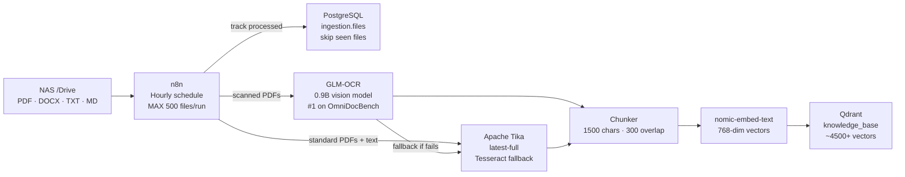
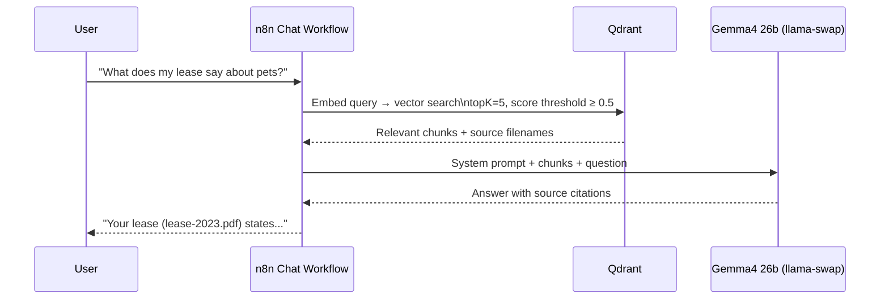

# NAS Knowledge Base — AI Document Chatbot

A RAG (Retrieval-Augmented Generation) chatbot that answers questions about any document stored on the NAS — PDFs, Word docs, text files, scanned images. Ask "what does my lease say about pets?" or "summarise my council tax bill" and it finds the answer.

---

## Architecture

### Ingestion Pipeline

### Chat Query Path

---

## Configuration

| Setting | Value | Why |
|---------|-------|-----|
| Chunk size | 1500 chars | Larger chunks = better semantic context vs default 1000 |
| Chunk overlap | 300 chars | Prevents mid-sentence splits losing context |
| Score threshold | 0.5 | Drops irrelevant matches — no forced answers from poor results |
| topK | 5 | Retrieves 5 best chunks per query |
| Vector dims | 768 | nomic-embed-text output size |
| Distance metric | Cosine | Standard for text embeddings |
| HNSW index threshold | 5000 | Index builds once collection exceeds 5000 points |

---

## OCR Pipeline

Standard PDF extraction fails on scanned documents (image-only PDFs). A separate OCR pipeline handles these:

1. **GLM-OCR** (primary) — 0.9B vision model, ranked #1 on OmniDocBench V1.5. Renders each PDF page to PNG (2× scale) and extracts text via vision inference
2. **Apache Tika** (fallback) — Tesseract OCR bundled in `tika:latest-full` image
3. Failed files tracked in Postgres with error type — retried by manual workflow run

---

## Stats

| Metric | Value |
|--------|-------|
| Total eligible files on NAS | ~640 |
| Successfully ingested | 533 |
| Qdrant vectors | ~4500+ (growing) |
| File types | PDF, DOCX, TXT, MD, HTML |
| Skipped (encrypted / tiny) | ~50 |

---

## n8n Workflows

| Workflow | Trigger | Purpose |
|----------|---------|---------|
| NAS File Ingestion Pipeline | Hourly | Scan NAS, ingest new files into Qdrant |
| ingestion sub-workflow | Called by pipeline | Chunk → embed → upsert per file |
| NAS Knowledge Base Chat | On message | RAG query → LLM response |
| NAS OCR Ingestion | Manual | Re-process failed scanned PDFs via GLM-OCR |
