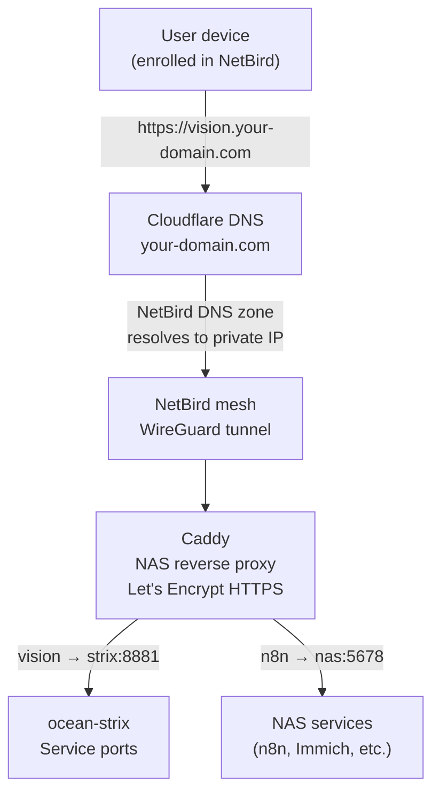
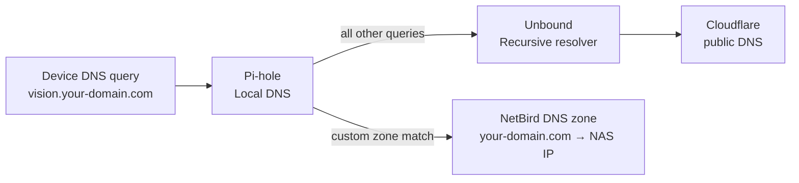

# Networking — NetBird, Cloudflare & Caddy

## Overview

All homelab devices are connected via [NetBird](https://netbird.io) — a self-hosted mesh VPN built on WireGuard. Every device gets a stable private IP and can reach any service as if on the same LAN, regardless of physical location.

HTTPS for all services is handled by Caddy on the NAS using Let's Encrypt with Cloudflare DNS-01 challenge — no port forwarding, no exposed ports on the router.

---

## Components

| Component | Where | Role |
|-----------|-------|------|
| NetBird management server | Hetzner VPS | Peer registry, key exchange, dashboard |
| NetBird agents | All devices | WireGuard tunnels to all peers |
| Cloudflare DNS | Cloud | One A record: `netbird.your-domain.com` → VPS |
| Caddy | UGREEN NAS | Reverse proxy + HTTPS for all services |
| Pi-hole + Unbound | UGREEN NAS | Local DNS resolver + upstream recursive DNS |

---

## Request Flow



---

## NetBird Setup

NetBird runs self-hosted on the Hetzner VPS. The management server handles peer registration and key exchange — actual traffic flows directly between peers (peer-to-peer WireGuard), not through the VPS.

```bash
# Check status on any enrolled device
netbird status

# Connect
netbird up --management-url https://netbird.your-domain.com:443
```

Dashboard at `https://netbird.your-domain.com` — shows all peers, their status, and allows SSH into any peer from the browser.

---

## Caddy Configuration Pattern

Caddy on the NAS handles HTTPS for all services. Each new service needs one block:

```
vision.your-domain.com {
    reverse_proxy ocean-strix-ip:8881
}
```

Certificate issuance is automatic via Cloudflare DNS-01 — works on any port, no firewall rules needed.

---

## DNS Architecture



NetBird injects a custom DNS zone into enrolled devices — so `vision.your-domain.com` resolves to the NAS's private IP on the mesh, not a public IP. External users without NetBird can't resolve these addresses.
