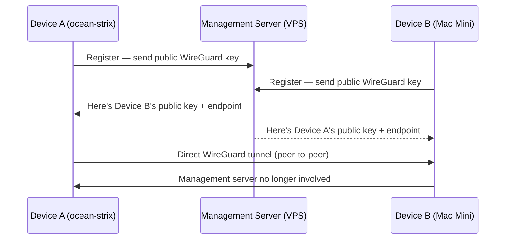
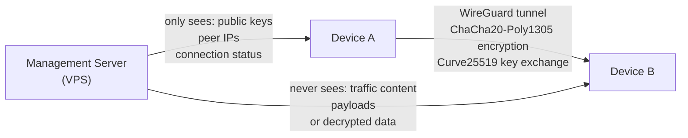
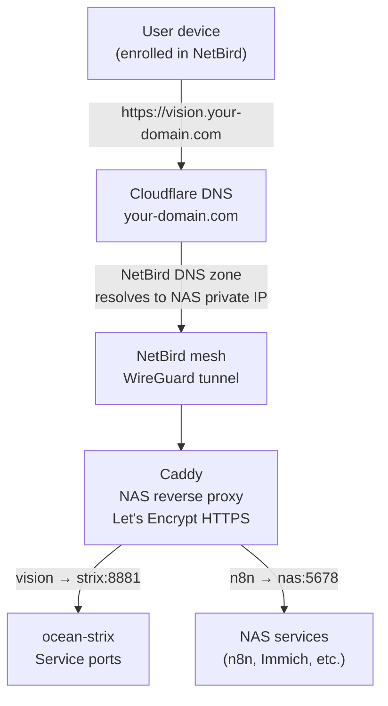
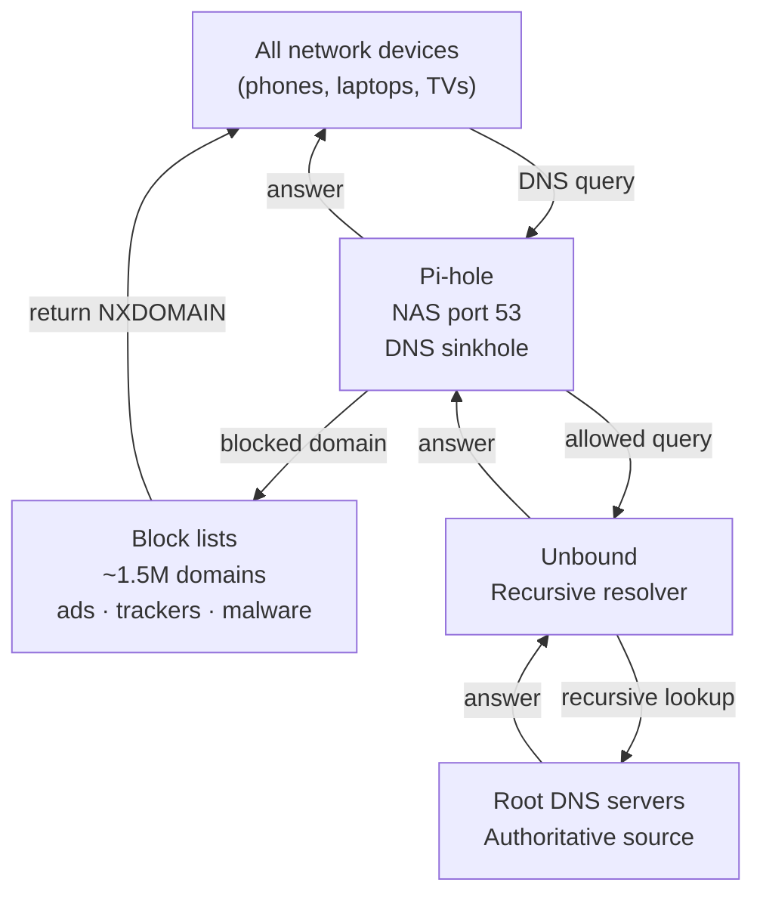
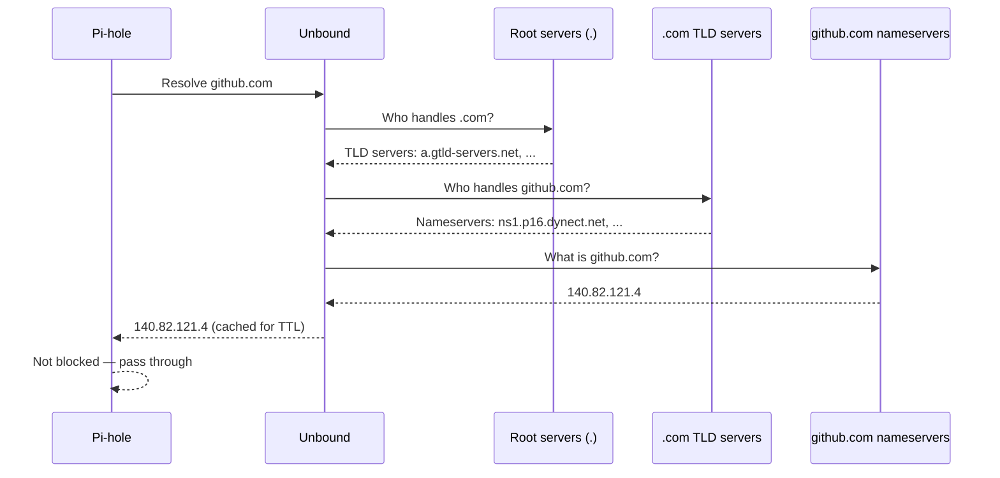
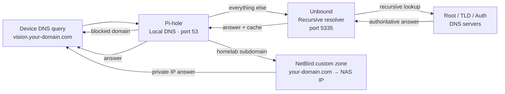

# Networking — NetBird, Cloudflare, Caddy & DNS

## Overview

All homelab devices are connected via [NetBird](https://netbird.io) — a self-hosted mesh VPN built on WireGuard. Every device gets a stable private IP and can reach any service as if on the same LAN, regardless of physical location.

HTTPS for all services is handled by Caddy on the NAS using Let's Encrypt with Cloudflare DNS-01 challenge — no port forwarding, no exposed ports on the router.

---

## Components

| Component | Where | Role |
|-----------|-------|------|
| NetBird management server | Hetzner VPS | Peer registry, key exchange, dashboard |
| NetBird agents | All devices | WireGuard tunnels to all peers |
| Cloudflare DNS | Cloud | One A record: `netbird.your-domain.com` → VPS |
| Caddy | UGREEN NAS | Reverse proxy + HTTPS for all services |
| Pi-hole | UGREEN NAS | Network-wide ad/tracker blocking + custom DNS |
| Unbound | UGREEN NAS | Recursive DNS resolver (upstream for Pi-hole) |

---

## How NetBird Works

NetBird is built on [WireGuard](https://www.wireguard.com/) — a modern, audited VPN protocol. NetBird adds a coordination layer on top: peer discovery, automatic key exchange, and access control policies.



**Key points:**
- The management server (VPS) only brokers the initial handshake — it never sees your traffic
- Once peers exchange keys, all communication is **direct peer-to-peer** encrypted WireGuard tunnels
- If two peers are on the same LAN, traffic stays local — it never goes to the VPS
- If direct connection isn't possible (strict NAT), NetBird falls back to a TURN relay, still encrypted end-to-end

---

## How Data Is Secured



| Layer | Mechanism |
|-------|-----------|
| Encryption | ChaCha20-Poly1305 (WireGuard) — authenticated encryption |
| Key exchange | Curve25519 elliptic-curve Diffie-Hellman |
| Authentication | Each device has a unique WireGuard key pair — only enrolled devices can join |
| Management server trust | Sees only public keys and peer metadata; never sees traffic content |
| Network exposure | No open ports on home router — outbound-only connections initiate the mesh |
| Access control | NetBird dashboard lets you define which peers can talk to which — zero-trust style |

WireGuard's cryptography is simpler and smaller than OpenVPN or IPSec — fewer lines of code means a smaller attack surface. It's been independently audited and is now part of the Linux kernel.

---

## Request Flow (service access)



Services are only reachable from enrolled NetBird peers — the private IPs don't resolve for anyone outside the mesh.

---

## NetBird Setup

NetBird runs self-hosted on the Hetzner VPS. The management server handles peer registration and key exchange — actual traffic flows directly between peers (peer-to-peer WireGuard), not through the VPS.

```bash
# Check status on any enrolled device
netbird status

# Connect
netbird up --management-url https://netbird.your-domain.com:443
```

Dashboard at `https://netbird.your-domain.com` — shows all peers, their status, and allows SSH into any peer from the browser.

---

## Caddy — HTTPS for Every Service

Caddy on the NAS handles HTTPS for all services using Let's Encrypt certificates issued via Cloudflare DNS-01 challenge. This means:

- **No port 80/443 required on the router** — DNS-01 proves domain ownership without an inbound connection
- **Wildcard certificates** — one cert covers all `*.your-domain.com` subdomains
- **Auto-renewal** — Caddy handles renewal silently in the background

Each new service needs one config block:

```
vision.your-domain.com {
    reverse_proxy ocean-strix-ip:8881
}
```

---

## Pi-hole — Network-Wide Ad Blocking

[Pi-hole](https://pi-hole.net/) runs on the NAS and acts as the DNS server for all devices on the local network. It intercepts DNS queries and blocks known ad, tracker, and malware domains before they even connect.



**What Pi-hole does:**
- Blocks ads at the DNS level — ads never load, pages feel faster
- Works for every device on the network with no per-device configuration
- Logs all DNS queries — useful for seeing what devices are "calling home"
- Custom DNS entries — used here to route homelab subdomains to the right internal IPs

---

## Unbound — Recursive DNS (No Third-Party Resolver)

Most setups forward DNS to Google (8.8.8.8) or Cloudflare (1.1.1.1). [Unbound](https://nlnetlabs.nl/projects/unbound/) resolves DNS recursively from the root — no third-party resolver sees your queries.



**Why recursive DNS matters:**
- No single company sees all your DNS queries (unlike forwarding to Google or Cloudflare)
- Answers come directly from authoritative sources — not from a resolver that could be tampered with or logged
- DNSSEC validation — Unbound checks cryptographic signatures to prevent DNS spoofing

---

## DNS Architecture — Full Picture



NetBird injects a custom DNS zone into enrolled devices — so `vision.your-domain.com` resolves to the NAS's private IP on the mesh, not a public IP. External users without NetBird can't resolve these addresses at all.
