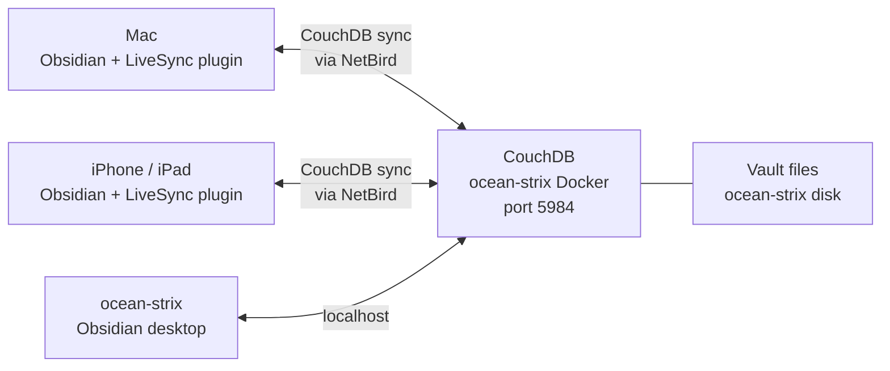

# Obsidian — Self-Hosted Sync

[Obsidian](https://obsidian.md) is a local-first markdown note-taking app. I use it as the homelab knowledge base and personal wiki — all infrastructure state, runbooks, and project notes live here.

Sync across devices (Mac, phone, ocean-strix) is handled by a self-hosted [LiveSync](https://github.com/vrtmrz/obsidian-livesync) setup using CouchDB — no Obsidian Sync subscription required.

---

## Why Self-Hosted Sync

- **Privacy** — vault never touches a third-party server
- **Speed** — syncs over the local NetBird mesh, not the internet
- **Cost** — CouchDB runs on ocean-strix for free vs Obsidian Sync's $10/month
- **Control** — full access to the database, can back up or inspect any time

---

## Architecture

All sync traffic goes over the NetBird mesh — CouchDB is not exposed to the public internet.

---

## Setup Summary

| Component | Detail |
|-----------|--------|
| CouchDB | Docker on ocean-strix, port 5984 |
| LiveSync plugin | Installed on all Obsidian clients |
| Vault name | `ocean` |
| Access | Via NetBird private IP — not publicly routable |
| Backup | CouchDB data directory bind-mounted to ocean-strix disk |

---

## Claude Code Integration

The Obsidian vault doubles as Claude Code's long-term memory for homelab sessions. A custom Obsidian CLI lets Claude agents read and write notes directly — so infrastructure state, service configs, and debugging findings are persisted in the vault rather than in ephemeral chat context.

Each homelab Claude Code session starts by reading `homelab/README.md` from the vault to orient itself before taking any action.
