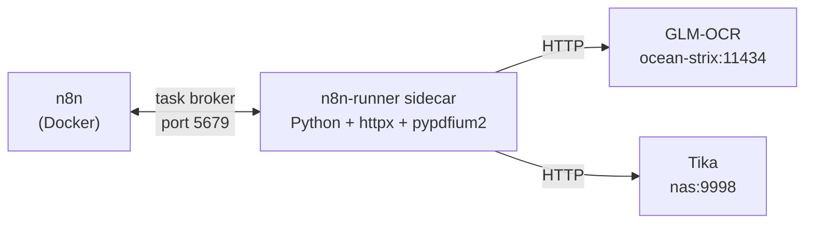

# n8n Automation Workflows

[n8n](https://n8n.io) is the automation backbone — it runs on the NAS and orchestrates the knowledge base ingestion pipeline, document OCR, and the AI chat interface.

**Deployment:** Docker on UGREEN NAS, connected to:
- PostgreSQL (workflow DB + ingestion tracking)
- Qdrant (vector store)
- llama-swap on ocean-strix (LLM + embeddings via OpenAI-compatible API)
- Apache Tika (document text extraction)
- NAS file mount at `/mnt/nas/Drive`

---

## Active Workflows

| Workflow | Trigger | Status |
|----------|---------|--------|
| NAS Knowledge Base — Chat | On chat message | Active |
| NAS File Ingestion Pipeline | Hourly | Active |
| ingestion sub-workflow | Called by pipeline | Active |
| NAS OCR Ingestion | Manual (UI) | Active |

---

## Workflow Details

### NAS File Ingestion Pipeline

Runs hourly. Scans `/mnt/nas/Drive` recursively for `.pdf .docx .txt .md .html .htm` files.

**Steps:**
1. List all eligible files from NAS mount
2. Query Postgres `ingestion.files` — skip already processed files
3. Skip files: `experian`/`statement` in filename, size < 1KB, encrypted PDFs
4. For each new file (max 500/run): call ingestion sub-workflow
5. Sub-workflow: extract text → chunk (1500/300) → embed (nomic-embed-text) → upsert to Qdrant → mark `done` in Postgres

### NAS OCR Ingestion

Manual workflow for scanned PDFs that failed standard extraction.

**Steps:**
1. Query Postgres for files with `status IN ('no_text_extracted', 'embed_error', 'tika_error')`
2. For each: render PDF pages to PNG (pypdfium2 in Python runner sidecar)
3. Send each page image to GLM-OCR → get text
4. If GLM-OCR fails → fallback to Tika
5. Chunk → embed → upsert to Qdrant
6. Mark `done` in Postgres with `ocrEngine` metadata

### NAS Knowledge Base — Chat

Public chat interface (n8n built-in chat widget).

**Steps:**
1. Receive user message
2. Embed query with nomic-embed-text
3. Search Qdrant `knowledge_base` — topK=5, score threshold 0.5
4. Build context from returned chunks (with source filenames)
5. Send to Gemma4 26b with RAG system prompt
6. Return answer with citations

---

## Python Runner Sidecar

n8n Code nodes support Python via an external runner sidecar (`n8nio/runners`). This enables PDF processing with `pypdfium2` and HTTP calls with `httpx` inside n8n workflows — same logic as a standalone script but with full n8n execution history and error UI.

