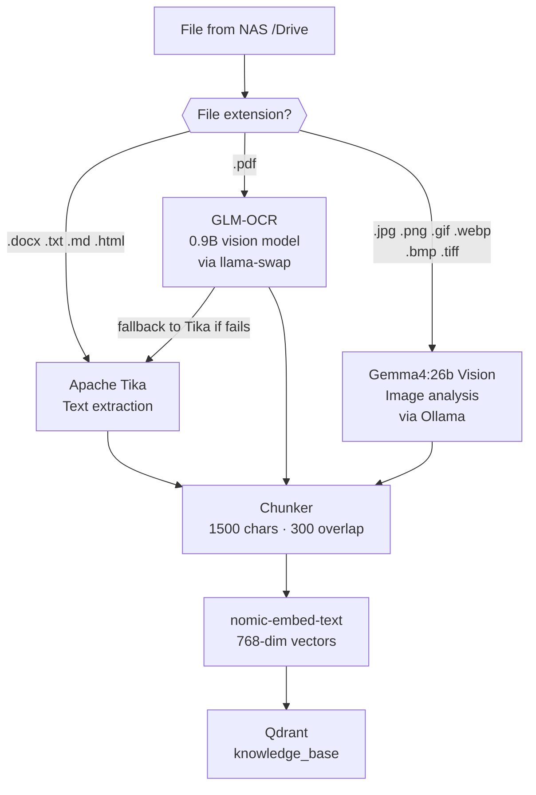
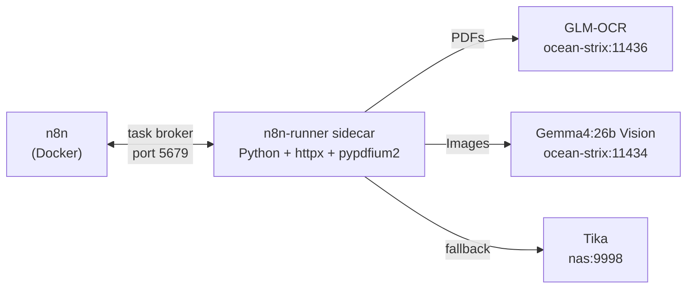

# n8n Automation Workflows

[n8n](https://n8n.io) is the automation backbone — it runs on the NAS and orchestrates the knowledge base ingestion pipeline, document OCR, image analysis, and the AI chat interface.

**Deployment:** Docker on UGREEN NAS, connected to:
- PostgreSQL (workflow DB + ingestion tracking)
- Qdrant (vector store)
- Ollama on ocean-strix (LLM + embeddings, port 11434)
- Apache Tika (document text extraction)
- NAS file mount at `/mnt/nas/Drive`

---

## Active Workflows

| Workflow | Trigger | Status |
|----------|---------|--------|
| NAS Knowledge Base — Chat | On chat message | Active |
| NAS File Ingestion Pipeline | Hourly | Active |
| ingestion sub-workflow | Called by pipeline | Active |
| NAS OCR Ingestion | Manual (UI) | Active — handles PDFs + images |

---

## File Type Routing

The ingestion pipeline routes each file to the right extraction engine based on its extension:

---

## Workflow Details

### NAS File Ingestion Pipeline

Runs hourly. Scans `/mnt/nas/Drive` recursively for `.pdf .docx .txt .md .html .htm` files.

**Steps:**
1. List all eligible files from NAS mount
2. Query Postgres `ingestion.files` — skip already processed files
3. Skip files: `experian`/`statement` in filename, size < 1KB, encrypted PDFs
4. For each new file (max 500/run): call ingestion sub-workflow
5. Sub-workflow: extract text → chunk (1500/300) → embed (nomic-embed-text) → upsert to Qdrant → mark `done` in Postgres

---

### NAS OCR Ingestion

Manual workflow for files that failed standard extraction — handles both scanned PDFs and image files.

**Extraction engine by file type:**

| File type | Engine | Model |
|-----------|--------|-------|
| `.pdf` (scanned) | GLM-OCR | 0.9B vision model — `#1 on OmniDocBench` |
| `.jpg .png .gif .webp .bmp .tiff` | Gemma4:26b Vision | Full 26B multimodal LLM via Ollama |
| Fallback (GLM-OCR fails) | Apache Tika | Tesseract OCR |

**Gemma4 image analysis prompt:**
> *"Analyze this image thoroughly. Describe all visible text, charts with their data, tables, diagrams, and visual elements in detail. Be comprehensive — this description will be used for semantic search indexing."*

This means photos, scanned forms, diagrams, screenshots, and infographics stored on the NAS all become searchable via the knowledge base chat.

**Steps:**
1. Query Postgres for files with `status IN ('no_text_extracted', 'embed_error', 'tika_error', 'glm_error')`
2. **PDFs:** render pages to PNG (pypdfium2, 2× scale) → send to GLM-OCR → fallback to Tika if fails
3. **Images:** send raw file to Gemma4:26b Vision via Ollama `/api/generate` with base64 image
4. Chunk (1500/300) → embed (nomic-embed-text) → upsert to Qdrant
5. Mark `done` in Postgres with `ocrEngine` metadata (`glm-ocr`, `gemma4-vision`, or `tika`)

---

### NAS Knowledge Base — Chat

Public chat interface (n8n built-in chat widget).

**Steps:**
1. Receive user message
2. Embed query with nomic-embed-text
3. Search Qdrant `knowledge_base` — topK=5, score threshold 0.5
4. Build context from returned chunks (with source filenames)
5. Send to Gemma4:26b with RAG system prompt + force tool use instruction
6. Return answer with source citations

**LLM:** Gemma4:26b via Ollama (port 11434) — same model used for image analysis, ensuring consistent understanding of indexed content.

---

## ocrEngine Metadata in Qdrant

Every chunk in Qdrant carries an `ocrEngine` field so you can trace how any piece of content was extracted:

| Value | Meaning |
|-------|---------|
| `tika` | Standard text extraction (DOCX, TXT, HTML) or Tika fallback |
| `glm-ocr` | Scanned PDF → GLM-OCR vision model |
| `gemma4-vision` | Image file → Gemma4:26b full description |

---

## Python Runner Sidecar

n8n Code nodes support Python via an external runner sidecar (`n8nio/runners`). This enables PDF processing with `pypdfium2` and HTTP calls with `httpx` inside n8n workflows — same logic as a standalone script but with full n8n execution history and error UI.

